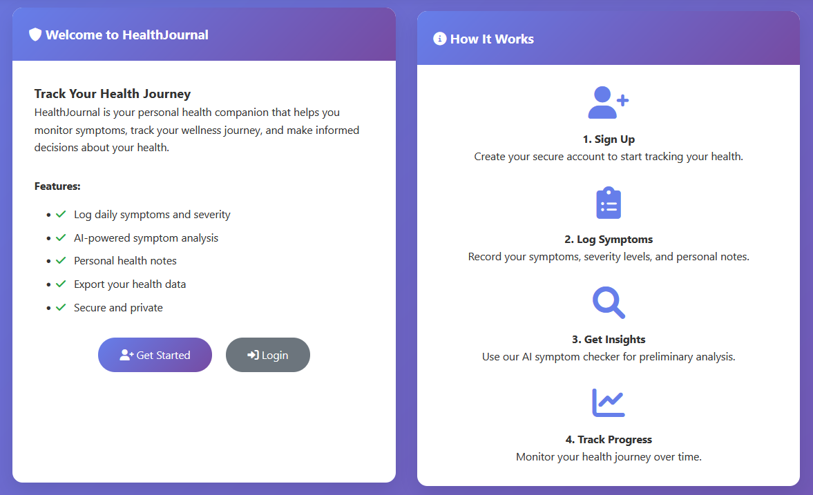
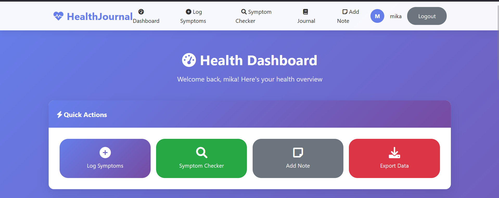
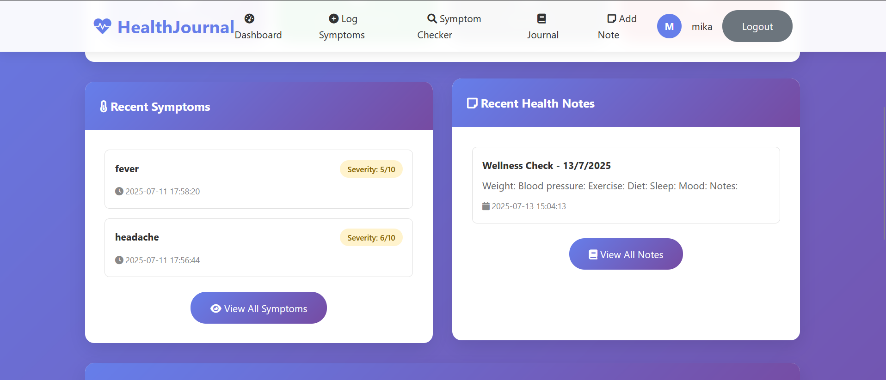
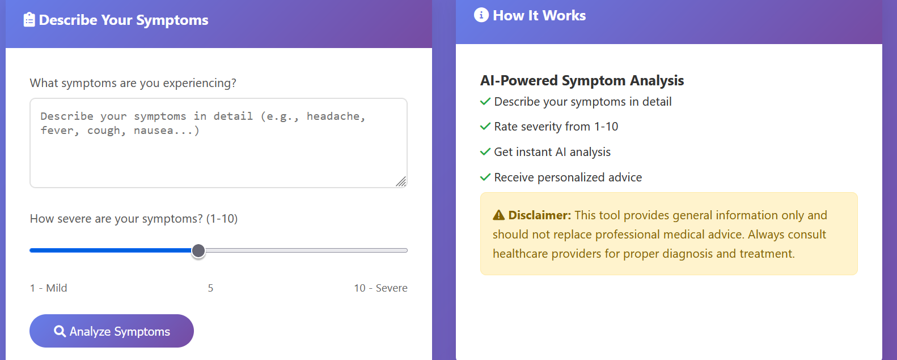
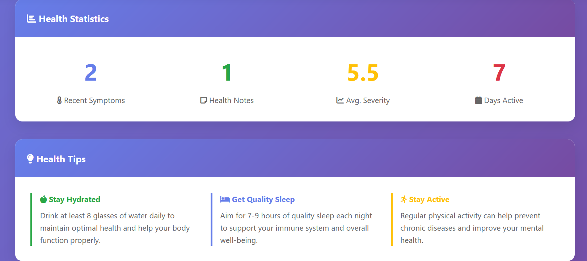

# 🩺 HealthJournal

**HealthJournal** is a Flask-based web application that empowers users to monitor their personal health by logging daily symptoms, recording notes, and receiving AI-driven symptom analysis. The app promotes self-awareness while encouraging users to consult medical professionals when needed.

---

## 🚀 Features

- **User Authentication** – Secure registration and login system
- **Symptom Logger** – Track daily symptoms with severity levels
- **AI Symptom Checker** – Get probable causes, severity insights, and helpful advice
- **Personal Health Notes** – Maintain a health journal for better tracking
- **Dashboard** – View recent logs and notes in one place
- **Export** – Download your health records in JSON format
- **Responsive UI** – Clean and intuitive user interface

---

## 🛠️ Tech Stack

- **Backend**: Python, Flask
- **Frontend**: HTML, CSS, Jinja Templates, FontAwesome
- **Database**: SQLite
- **Security**: Password hashing (Werkzeug), session-based login
- **AI Logic**: Rule-based symptom analysis

---
## 🖼️ Screenshots

### 🔹 Home Page


### 🔹 Alternative Home Layout


### 📊 Dashboard


### 📊 Dashboard View 2


### 🧠 AI Symptom Checker


### 📝 Symptom Logging Form

---

## ⚙️ Setup Instructions

1. **Clone the Repository**
```
git clone https://github.com/yourusername/HealthJournal.git
cd HealthJournal
```
2. **Create Virtual Environment (Optional)**
```
python -m venv venv
source venv/bin/activate      # Linux/macOS
venv\Scripts\activate         # Windows
```
3. **Install Dependencies**
```
pip install flask werkzeug
```
4. **Run the Application**
```
python app.py
```
---
❗ Disclaimer

This app is intended for educational and informational purposes only. It does not provide professional medical advice, diagnosis, or treatment. Always consult a qualified healthcare provider for medical concerns.


